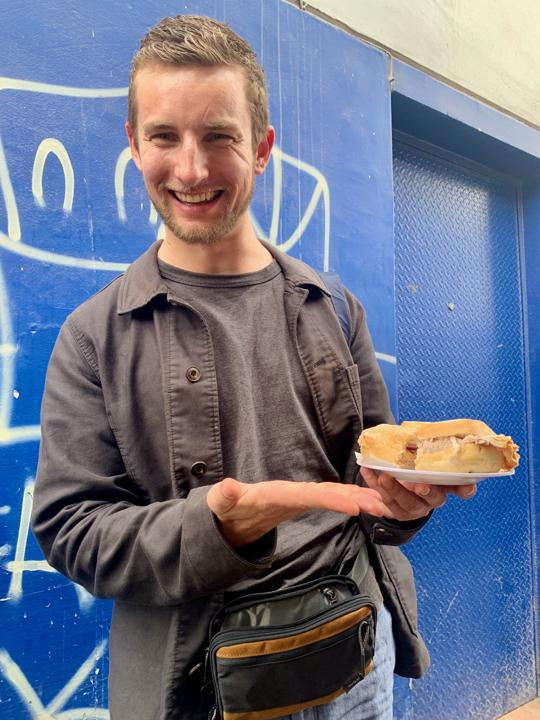

# La bienvenida

<ImageText image="img/group_breakfast.jpg">
El 29 Febrero de 2024 fue el gran día en el que empezó mi primer viaje a Latino América
junto a mis amigos Marivi, Juan y Juan-Carlos. ¡Qué maravilla la opción
de poder embarcar en un vuelo directo de Madrid a Lima para recibir la bienvenida del Perú 
doce horas después!
Me siento muy afortunado de haber conocido a la familia de Marivi que sigue viviendo en el Perú
después de que ella se fuera a España hace ya muchos años. Empezamos nuestra aventura culinaria con un
desayuno fuerte en un restaurante típico en el corazón de Lima.
</ImageText>

# La fiesta

<ImageText image="img/fiesta.jpg">
¡Qué suerte tuvimos que no nos faltaron razones para festejar! Un día después de nuestra llegada,
celebramos mi cumpleaños con una cena con un espectáculo de brisas del Titicaca, un
baile folclórico de la región de Puno en el sur del Perú. Aquí tuve la oportunidad de
demostrar las capacidades de baile que desarrollé durante los últimos dos años. Sin descanso
celebramos la próxima fiesta del cumpleaños, la de Marivi. Toda la familia
se juntó para esta ocasión especial y la fiesta fue inolvidable.

Pero... ¿a dónde ir como turista sin ninguna idea de la ciudad? ¡Fácil! Miraflores ofrece una
gran variedad de bares y discotecas donde se puede disfrutar la noche.
</ImageText>

# ¿Qué comer?

<ImageText image="img/ceviche.jpg">
Junto con la fiesta, la comida es la razón principal para realizar una visita a Lima. Gracias a su
ubicación en la costa del Pacífico, en Lima se come el mejor ceviche del
mundo. El ceviche es un plato de pescado blanco y crudo marinado con una salsa de ají y limón 
que se suele servir con lechuga y choclo, un tipo de maíz. Esta fresca combinación le hace mi plato favorito por el clima
cálido y húmedo presente en Lima. Los mejores sitios para un buen ceviche son los restaurantes
[Moya](https://maps.app.goo.gl/D5fQKmDWdKfX4QNx5) y [La Caleta de la Punta](https://maps.app.goo.gl/8wQPQXdwWpBtxYURA).
</ImageText>

¡Pero Thilo, alguien me ha dicho que se come muy barato en el Perú! ¿Por qué tengo que pagar
hasta 15€ por un ceviche? Para encontrar los mejores precios hay que elegir los lugares
menos turísticos.
La mejor relación calidad-precio está disponible en los mercados y restaurantes
ambulantes. En el [Mercado de Magdalena](https://maps.app.goo.gl/bLL54W9g371ddWob9) 
se puede comprar de todo: verdura, fruta,
carne, pescado y platos preparados. Aquí encuentras un buen almuerzo por sólo 3€. Además,
una experiencia auténtica es un desayuno de jamón cocido con rocoto en un pan acompañado
por un café americano fuerte en el ambulante [Son de Jamón de Angel y Luz](https://maps.app.goo.gl/SXYyZ9VoikixyJDRA).

# ¿Qué hay que ver?

<ImageText image="img/cathedrale.jpg">
Al lado de los placeres del gusto y el alma, Lima ofrece un rico centro histórico que requiere de
uno a dos días para descubrirlo. Los edificios más impresionantes seguramente sean la catedral
y los catacumbas. Por la influencia española durante la época colonial la arquitectura parece
andaluza y los edificios están decorados ricamente con oro y plata. Merece la pena hacer un
tour guiado por el centro histórico para aprender algo de contexto.

# Resumen

Lima es una ciudad contrastes: ¿Deseas un sitio verde y tranquilo? ¡Sin problema! Ve a
Barranco y disfrutarás las vistas del Pacífico. ¿Un buen ceviche en un restaurante de moda?
Desplázate a la Punta de Callao pero que no te extrañe el distrito pobre y feo que atravesarás
en este trayecto. ¿Luego por la noche te apetece una aventura? Encontrarás todo lo que quieras
en Miraflores pero evita pasar alrededor del centro en la oscuridad. Sin embargo Lima es una ciudad segura que merece la pena visitar.
</ImageText>

